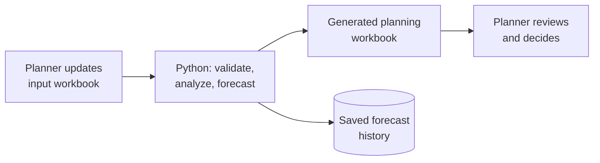
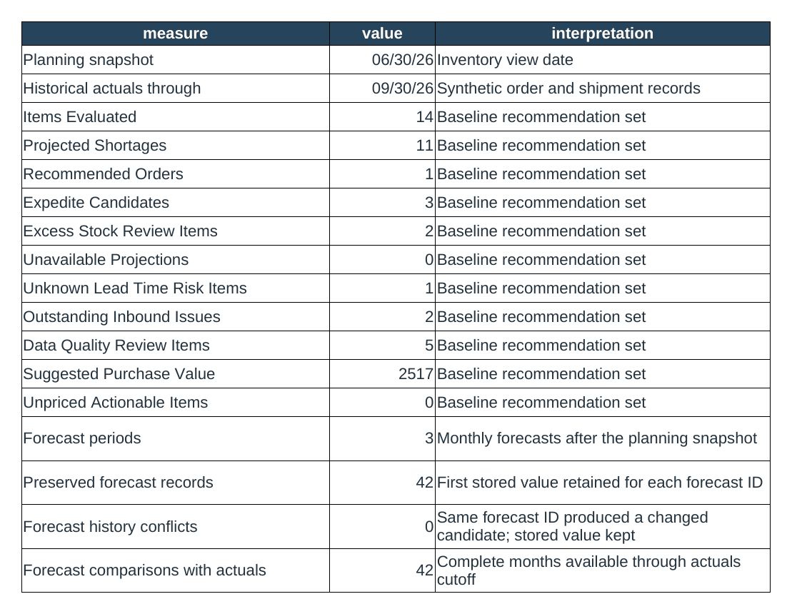

# Operations Forecasting System

**Spreadsheet in, planning workbook out: inventory forecasts and reorder recommendations that a person reviews before anything is ordered.**

`Status: rebuilt from an Excel tool I built and used in my logistics job · synthetic data · Python + Excel · 47 tests`

---

## Where this came from

In my logistics role, questions like *"Are we going to run out of this part?"* or *"Is demand actually up, or does it just feel busy?"* usually got answered by gut feel. So I built an Excel workbook that pulled order, shipping, and inventory history together and showed the trends.

I used it about ten times, whenever a decision needed evidence or an assumption needed checking. I don't have formal accuracy or savings numbers, and I don't claim any. What it gave me was simple: **data to point to instead of a hunch.**

This repository rebuilds that tool properly, with fictional data. The people doing the work keep using Excel; Python sits in between, doing the analysis that's tedious and error-prone by hand.



## What it produces

A [14-sheet planning workbook](generated_example/logistics_forecast.xlsx) (dashboard, trends, forecasts, scenarios, recommendations, review queue, audit), plus a [plain-language report](generated_example/planning_report.md).

The workbook's Dashboard sheet, generated from the fictional demo data:



From the report:

| Item | Available | At lead time | Projected stockout | Action | Qty | Why it needs a person |
|---|---:|---:|---|---|---:|---|
| PART-010 | 25 | -3 | 2026-07-13 | EXPEDITE | 83 | — |
| PART-002 | 90 | 20 | 2026-08-15 | ORDER | 90 | — |
| PART-005 | 10 | -11 | 2026-07-11 | HUMAN REVIEW | withheld | Purchase order is overdue |
| PART-009 | 20 | 6 | 2026-07-21 | HUMAN REVIEW | withheld | Not enough history to forecast |
| KIT-002 | -4 | unknown | 2026-06-30 | HUMAN REVIEW | withheld | Stale count, unknown lead time, inconsistent quantities |
| PART-008 | 500 | 483.7 | none | REVIEW EXCESS | 0 | — |

It also runs "what if" scenarios on the same data: demand up 20%, lead times two weeks longer, an inbound PO delayed.

## The decisions that matter

**It never touches the source spreadsheet.** The input workbook is opened read-only. The person who maintains it is the source of truth, and the system can't quietly change their data.

**When the data is bad, it withholds the number.** With an overdue PO, a stale count, or too little history, the system doesn't produce a confident-looking order quantity. It says "withheld" and explains why. A wrong number with a decimal point looks more trustworthy than it deserves.

**Old forecasts can't be rewritten.** Every forecast is saved with a permanent ID. When the actual demand comes in, it's compared against what was *really* predicted at the time, not a recalculated version. If new data would change an old forecast, that's flagged as a conflict instead of silently fixed. This is how you find out whether a forecast method is any good.

**A confirmed inbound PO counts; a hopeful one doesn't.** Dated, confirmed purchase orders reduce the reorder need. Overdue or undated ones are flagged and left out, so a late shipment doesn't hide a real shortage.

**Recommendations are proposals.** It doesn't place orders or connect to an ERP. A planner decides.

The forecast itself is intentionally simple: a moving average over up to three complete months, with flags for spikes, gaps, and irregular demand. I chose a method a planner can check by hand over one they'd have to take on faith. Details: [forecasting method](docs/forecasting-method.md) · [decision boundaries](docs/decision-boundaries.md).

## Where AI would fit next (not built yet)

The slowest part of the original process was typing information from invoices, POs, and shipping documents into the spreadsheet. The next step I'm designing:

```text
document -> AI extracts PROPOSED facts (with evidence + uncertainty)
         -> person approves, corrects, or rejects
         -> only approved facts enter the record
```

AI output is a proposal, not a fact, until a person approves it. This repo includes only the type boundary that enforces that rule (a proposed record is rejected at the door, and tests prove it). Extraction isn't built yet, and I'd rather use it for real before publishing it. See [project history](docs/project-history.md).

## Run it

Python 3.11+ and `openpyxl`.

```bash
python -m pip install -e .
operations-forecast-demo
python -m unittest discover -s tests -v
```

## Limits

All items, customers, prices, and quantities are fictional. The forecast is a practical baseline, not a statistically validated model. It doesn't model seasonality, returns, promotions, or supplier capacity, and the forecast history is a local file, not a multi-user database.

---

Built by [Michael Perry](https://perry.is). I designed the workflow from my own logistics work and specified the behavior and tests, then directed AI coding agents to implement it and reviewed the result. [More of my work →](https://github.com/perry-is)
