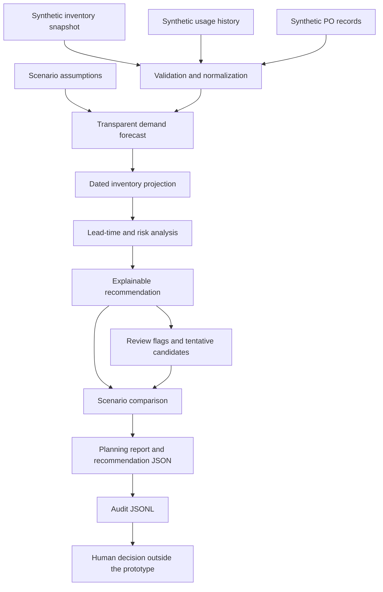

# Operations Forecasting System

An explainable operations-planning prototype that turns inventory, usage history, and dated inbound supply into forecasts, risk dates, and purchasing proposals. Every result separates source facts, calculated projections, recommendations, and human decisions.

This project is a clean-room reconstruction and extension of a logistics forecasting workflow I originally built and used in an operational environment. The original Excel-based system was consulted on roughly ten occasions to examine inventory demand, shipping/order trends, sales progression, recurring patterns, and rough forward-looking behavior, particularly when operational questions or assumptions needed to be checked against available data.

The original tool provided an evidence layer for human decisions. There are no formal measured outcome metrics: this repository makes no claims about improved forecast accuracy, reduced costs, prevented stockouts, or measured productivity gains. The public implementation replaces all real operational data with synthetic records and makes selected planning rules reproducible, inspectable, and testable.

## The operational problem

A stock count can look healthy while demand during replenishment lead time makes it risky. Conversely, ignoring a confirmed incoming purchase order can create an unnecessary buying recommendation. Weak history, stale counts, and unreliable receipt dates need to remain visible when interpreting either result.

The prototype helps a planner ask what may run out, when it may run out, what quantity might be needed, and which assumptions deserve review. It is decision support: it creates no purchase orders, connects to no ERP, and records no approval on a person's behalf.

## Original use, public rebuild, and future design

| Stage | Scope and status |
|---|---|
| Original workflow — actually used | Operational Excel data, a separate forecast/analysis workbook, trend and recurring-pattern analysis, inventory-demand visibility, sales/order/shipping progression, and human review. A practical tool used repeatedly, not an enterprise platform or statistically validated model. |
| Public implementation — included here | Invented CSV records, validation and normalization, Python demand/inventory calculations, dated PO handling, explicit review flags, four scenarios, inspectable recommendation/audit artifacts, tests, and CI. |
| Public rebuild roadmap — not yet implemented | Excel input/output adapters, automatic forecast-history preservation, forecast-versus-actual tracking, and a persistent review queue. This version's report exposes review flags; it is not a review-management application. |
| Future authorized intake — design only | Controlled extraction from authorized documents/systems, proposed facts with evidence and uncertainty, conversational human verification, and approved canonical records reusable across operational workflows. This AI-assisted layer did not exist in the original implementation and is not called by this demo. |

The portfolio story is an operational need identified and addressed with a tool that was actually used, followed by a cleaner public reconstruction and a responsible modernization plan. See [project history and evolution](docs/project-history.md) for the boundaries and diagrams.

## Pipeline



Each scenario reuses the same immutable input records. Results retain the observed snapshot and the scenario assumptions separately. [Architecture details](docs/architecture.md) map the modules to these stages.

## How calculations become recommendations

**Forecast:** usage across the last three complete calendar months divided by their actual observed day counts. Missing months are not silently filled with zeros. Daily rates are rounded to six decimal places; the forecast period is normally 90 days. Sparse history, a recent spike, or intermittent demand gets explicit flags. `adequate_history` describes input coverage, not statistical confidence or an accuracy guarantee.

**Inventory:** current on hand is the count; current available subtracts allocations. Projected available adds eligible confirmed supply on its effective receipt date and subtracts modeled daily demand. The projection separately reports the end-of-horizon value and stock at the lead-time horizon. Incoming stock never becomes current on hand in these calculations.

**Inbound supply:** POs have their own IDs, quantities, dates, and statuses. Only confirmed, positive, future-dated receipts are eligible. Overdue or undated confirmed POs are excluded and flagged. Received, cancelled, and unconfirmed records are not credited. Duplicate PO references stop ingestion. There is no second incoming-quantity field to count the same supply twice.

**Risk:** daily balances produce the first estimated date strictly below zero, minimum stock, and a safety threshold of `minimum_stock × 1.25`. A new order is assumed to arrive at the start of its lead-time date; demand is deducted at day end. Risk dates describe the projection before any proposed new purchase.

**Recommendation:** use `EXPEDITE` when modeled shortage precedes a standard new receipt. Use `ORDER` when projected stock falls below safety before an order placed at the next seven-day review could arrive. The order quantity is the ceiling of the target-stock gap at receipt; an expedite candidate also covers any earlier bridge shortfall. The effective target is at least safety stock plus seven days of usage. All quantity inputs are retained in the explanation.

**Excess:** available stock plus eligible horizon inbound above the greater of `1.5 × target_stock` and twice projected horizon demand generates an excess flag. The proposed response is a review of future buying, never automatic disposal. Later risks produce `MONITOR`; a healthy projection produces `NO ACTION`.

**Human review:** data-quality flags change the action to `HUMAN REVIEW` and withhold the suggested quantity. A separate candidate action/quantity may show the tentative calculation for investigation. Expedite and excess recommendations also require review. Every human-decision field starts as `not_recorded`; recommendations never equal approvals. Criticality changes priority, not demand arithmetic.

See [forecasting and planning formulas](docs/forecasting-method.md) and [decision boundaries](docs/decision-boundaries.md).

## Synthetic scenario

The fictional snapshot closes on June 30, 2026. Fourteen items, 79 monthly usage rows spanning January–June, and seven invented PO records cover stable, rising, intermittent, spiking, declining, sparse, and zero-recent-demand patterns.

Examples of explainable behavior:

- `PART-001`: 120 on hand minus 10 allocated gives 110 available; usage of one per day leaves 20 at day 90. No action.
- `PART-003`: 100 currently available appears substantial, but three units/day over a 40-day lead time projects −20. Expedite candidate: 200 units to meet the modeled arrival target.
- `PART-004`: a confirmed 60-unit receipt prevents an immediate reorder. Delaying that receipt by 21 days exposes a July 26 stockout and an expedite candidate.
- `PART-011`: a 20% demand increase changes monitoring to a 44-unit order proposal.
- `PART-012`: adding 14 lead-time days changes monitoring to a 59-unit order proposal.
- Sparse history, an overdue PO, a stale/overallocated count, and unknown lead time produce visible review cases.

These are constructed examples of rule behavior, not evidence of outcomes achieved in the original workplace tool. All descriptions, quantities, prices, references, and dates are invented.

## Run locally

Python 3.11+; no runtime dependencies, credentials, model, or network calls. Package installation may download normal build tooling.

```sh
python -m pip install -e .
python -m operations_forecasting.demo
python -m unittest discover -s tests -v
```

An optional virtual environment is recommended. The `operations-forecast-demo` entry point runs the same demo. Run from this editable source checkout so the synthetic example files are available.

```sh
operations-forecast-demo --output-dir generated_example --horizon-days 90 --safety-factor 1.25
```

The demo generates four scenarios: `BASELINE`, `DEMAND +20%`, `LEAD TIME +14 DAYS`, and `INBOUND PO DELAYED` (21-day delay). Scenario dates and quantities change in the projection without altering source records. Default output files are reproducible and overwritten on rerun; use a separate output directory to retain a snapshot. Automatic forecast-history management and forecast-versus-actual evaluation remain planned improvements.

## Outputs and audit trail

- [Planning report](generated_example/planning_report.md): baseline totals, item-level actions, review flags, and scenario comparisons.
- [Recommendations](generated_example/recommendations.json): all 56 item/scenario records, including observed facts, forecasts, dated risks, inbound decisions, reasons, and proposed quantities.
- [Audit trail](generated_example/audit.jsonl): one explanation per item/scenario, including source usage/PO records, calculation policy, scenario assumptions, results, and unrecorded human decisions.

Decimal quantities and costs are serialized as decimal strings to preserve their representation. The purchase-value total uses fictional currency units and excludes withheld human-review candidates and unpriced items. The report counts unpriced actionable items separately.

## Repository map

```text
src/operations_forecasting/  Immutable models, CSV ingest, forecasts, inventory, purchasing, scenarios, reporting
examples/                   Three entirely synthetic CSV fixtures
generated_example/          Reproducible report, recommendations, and audit trail
tests/                      Focused unittest suite including the CLI workflow
docs/                       Architecture, history, methods, decision and privacy boundaries
diagrams/                   Mermaid pipeline source
.github/workflows/tests.yml  Ubuntu / Python 3.11 tests on push and pull request
```

## Limits and privacy

This is a portfolio prototype, not production purchasing software. It assumes constant daily future demand, fixed lead times, and timely confirmed receipts. It does not model seasonality, service-level probabilities, production dependencies, pack sizes, minimum order quantities, working-day calendars, budgets, supplier capacity, or purchase execution. Negative projections represent modeled unmet demand, without a separate lost-sales/backorder policy.

No original workbook, employer/customer/supplier identity, private process, real price, part number, PO, or operational data was inspected or copied. The original-use account comes from the author's confirmed history; the public rules and fixtures were newly constructed for this project. See [privacy boundaries](docs/privacy-boundaries.md).
