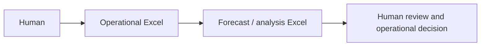
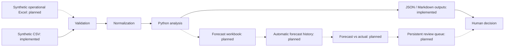
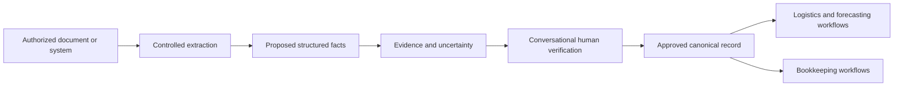

# Project history and evolution

## Original workflow — actually used

The author built an Excel-based logistics forecasting workflow for real operational work and consulted it on roughly ten occasions. It helped examine inventory demand, shipping/order trends, sales progression, recurring operational patterns, and rough forward-looking behavior. Its role was to provide evidence when questions arose or assumptions needed to be checked against available data.

This was a practical operational tool. There are no formal measured outcome metrics and no claim that it was enterprise software or a statistically validated forecasting model. Neither the original workbooks nor their data, organization-specific procedures, or environment are included here. No AI-assisted document intake is attributed to this original implementation.

## Public rebuild — implemented and planned

The current clean-room implementation replaces operational records with synthetic CSV fixtures and uses Python for normalization, validation, forecasting, dated inventory projection, scenario analysis, and recommendation reports. It adds explicit review flags, inspectable audit records, automated tests, CI, and documented assumptions.

The fuller public rebuild direction is shown below. Dashed nodes are planned and are not delivered by this version. The current report supplies review items but has no persistent review-queue state or decision-approval interface.

Audit output preserves the inputs and forecast for the current run. Separate output directories can retain run snapshots, but the default demo overwrites its three artifacts. Do not describe this as automated forecast-history storage or forecast-versus-actual tracking.

## Future authorized intake — architecture only

This proposed extension would keep extracted proposals separate from approved facts. A reviewer would see source evidence and uncertainty before a value entered an approved canonical record. Sharing approved records across workflows would require explicit authorization and appropriate access boundaries. This layer is not implemented, did not exist in the original workplace tool, and introduces no live AI calls into the demo.
