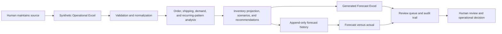
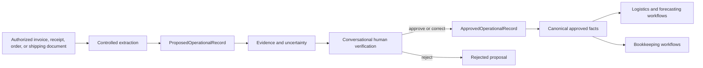

# Project history and evolution

This project has three distinct stages. The original work system was actually used. The repository is a synthetic public reconstruction. Document intake is a future design extension and did not exist in the original workflow.

## A. Original system — actually used

I built and used an Excel-based forecasting and analysis workflow in real logistics work. I consulted it on roughly ten occasions to help answer operational questions, examine trends, and check assumptions against available data.

It helped examine:

- inventory demand
- order and shipping trends
- sales progression
- recurring operational patterns
- rough forward-looking behavior and predictability
- whether an assumption about demand or workload was supported by the data

It served as a practical evidence layer. There are no formal measured outcome metrics. This history does not support claims of improved accuracy, lower costs, reduced workload, higher sales, fewer stockouts, or measured productivity gains. The original tool was not enterprise software or a statistically validated forecasting model. Its workbooks, source code, records, identities, and employer-specific processes are not included here.

## B. Public clean-room rebuild — implemented

The public implementation replaces operational information with a wholly synthetic workbook. The human-maintained workbook is the source of truth for the demo; Python reads it without writing to it.

The input workbook contains `README`, `Orders`, `Shipments`, `Inventory`, and `Operational_Updates`. The generated workbook contains the implemented analysis sheets documented in the root README. Forecast snapshots are additionally preserved in a JSONL history file, keyed by planning date, item, and target month. When later actuals arrive, the system compares them with the first saved forecast. An existing snapshot is not silently recomputed or overwritten. A changed candidate for the same forecast ID is reported as a conflict while the stored forecast remains intact.

The rebuild adds Python validation, normalization, reproducible weekly/monthly and customer/category analyses, inventory-demand progression, transparent forecasts, lead-time projection, scenarios, review flags, output workbooks, forecast history, forecast-versus-actual measures, automated tests, CI, and an inspectable audit trail. These are public implementation improvements; they should not be attributed to the original Excel files unless listed above as confirmed original capabilities.

The synthetic demonstration is not a reconstruction of actual item records, customers, vendors, quantities, costs, or internal procedures. No measured business outcomes are represented.

## C. Future design extension — authorized intake and shared approved facts

This is a concrete later architecture, not a feature of the original workplace system and not part of the current Excel demo. A future authorized invoice, receipt, order, or shipping document would pass through controlled extraction into proposed facts that retain evidence and uncertainty. A human would approve, correct, or reject each proposal. Only an `ApprovedOperationalRecord` could enter a canonical approved-fact layer; a `ProposedOperationalRecord` is deliberately a different type and is rejected at that boundary. Approved facts could then support logistics and/or bookkeeping workflows under an explicit authorization and access policy.

No LLM, OCR, document upload, canonical database, conversational review UI, or cross-workflow sharing is implemented. The two deterministic record types and admission tests demonstrate only the proposal/approval boundary.
